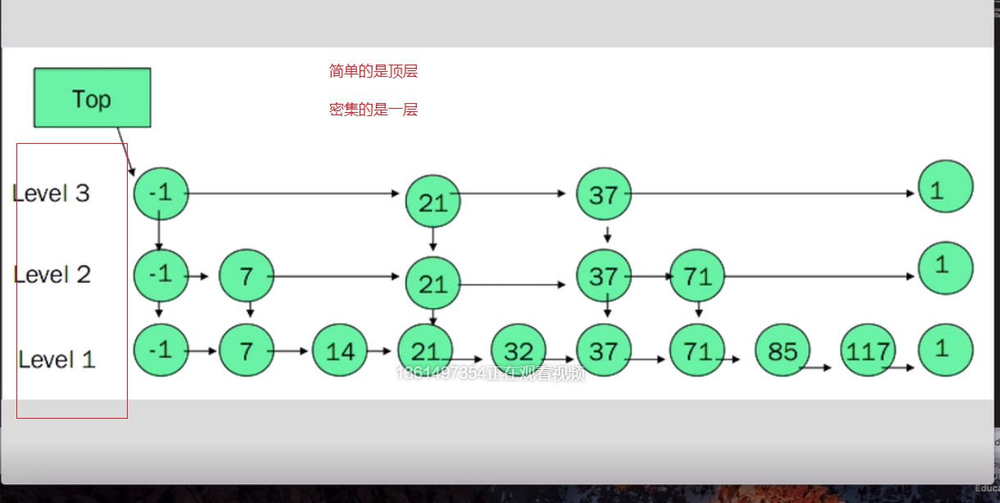

# Online-payment-project-Practice
redis基础与在线支付项目实战
# Redis基础知识
**基础命令多实践足矣,在此只总结一下探究性的知识**

## redis五种数据类型的底层数据结构

1. String/Int
struct sdshdr{
    int len;
    int free;
    char buf[];
}

2. Hash
Map<String,Map<String,String>>;第一个String是区分多个Hash的名称
3. List
双端队列,可以进行lpush,lpop,rpush,rpop
4. Set(数据不可重复,可以进行数据集的交叉并补)
Map<String,Map<String,Object(空)>>
5. SortSet(数据不可重复,有序)
Map<String,Map<String,Object(空)>> + 跳表:如下图所示
**跳表的性能和树差不多,但是比树占用的空间要少很多**

## 其他特性 
### 订阅
1. PUBLISH将信息message发送到指定的频道channe1。返回收到消息的客户端数量
2. SUBSCRIBE订阅给指定频道的信息
3. UNSUBSCRTBE取消订阅指定的频道，如果不指定，则取消订阅所有的频道。

redis的消息订阅发布和mq对比？

答：redis发布订阅功能比较薄弱但比较轻量级，mq消息持久化，数据可靠性比较差，无后台功能可msgId、msgKey进行查询消息

### Redis事务机制
1. MULTI 与 EXEC命令
以 MULTI 开始一个事务，然后将多个命令入队到事务中， 最后由 EXEC 命令触发事务， 一并执行事务中的所有命令
2. DISCARD命令
DISCARD 命令用于取消一个事务， 它清空客户端的整个事务队列， 然后将客户端从事务状态调整回非事务状态， 最后返回字符串 OK 给客户端， 说明事务已被取消。
3. WATCH命令
WATCH 命令用于在事务开始之前监视任意数量的键： 当调用 EXEC 命令执行事务时， 如果任意一个被监视的键已经被其他客户端修改了， 那么整个事务不再执行， 直接返回失败。

[mysql的ACID(redis没有)](https://blog.csdn.net/justloveyou_/article/details/70312810)
[数据库的四种事务机制](https://www.cnblogs.com/jycboy/p/transaction.html)

>共享锁【S锁】
>又称读锁，若事务T对数据对象A加上S锁，则事务T可以读A但不能修改A，其他事务只能再对A加S锁，而不能加X锁，直到T释放A上的S锁。这保证了其他事务可以读A，但在T释放A上的S锁之前不能对A做任何修改。
>
>排他锁【X锁】
>又称写锁。若事务T对数据对象A加上X锁，事务T可以读A也可以修改A，其他事务不>能再对A加任何锁，直到T释放A上的锁。这保证了其他事务在T释放A上的锁之前不能>再读取和修改A

## redis数据库事务的ACID与传统关系型事务的比较     
       1、 原子性（Atomicity）

           单个 Redis 命令的执行是原子性的，但 Redis 没有在事务上增加任何维持原子性的机制，所以 Redis 事务的执行并不是原子性的。
           如果一个事务队列中的所有命令都被成功地执行，那么称这个事务执行成功。
     
       2、 一致性（Consistency）

            入队错误
                在命令入队的过程中，如果客户端向服务器发送了错误的命令，比如命令的参数数量不对，等等， 那么服务器将向客户端返回一个出错信息， 并且将客户端的事务状态设为 REDIS_DIRTY_EXEC 。

            执行错误
                如果命令在事务执行的过程中发生错误，比如说，对一个不同类型的 key 执行了错误的操作， 那么 Redis 只会将错误包含在事务的结果中， 这不会引起事务中断或整个失败，不会影响已执行事务命令的结果，也不会影响后面要执行的事务命令， 所以它对事务的一致性也没有影响。

       3、隔离性（Isolation）

            WATCH 命令用于在事务开始之前监视任意数量的键： 当调用 EXEC 命令执行事务时， 如果任意一个被监视的键已经被其他客户端修改了， 那么整个事务不再执行， 直接返回失败。

       4、持久性（Durability）

            因为事务不过是用队列包裹起了一组 Redis 命令，并没有提供任何额外的持久性功能，所以事务的持久性由 Redis 所使用的持久化模式决定

